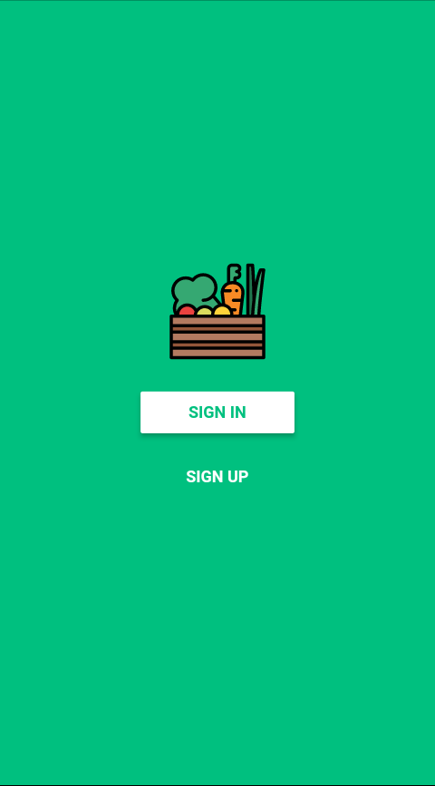
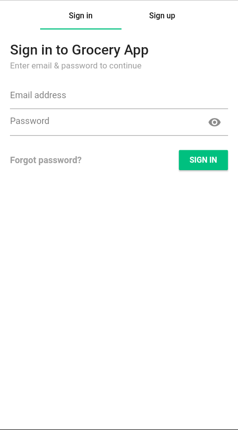
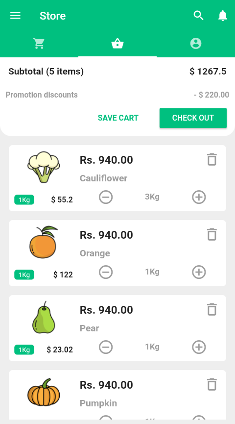
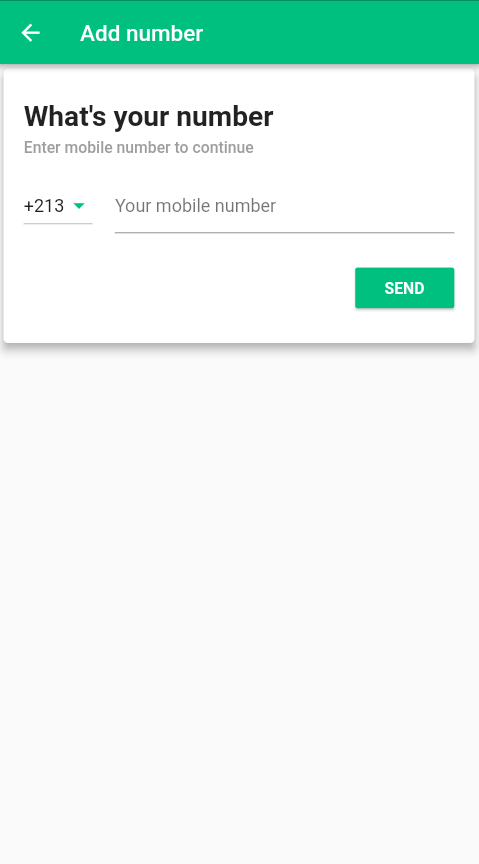
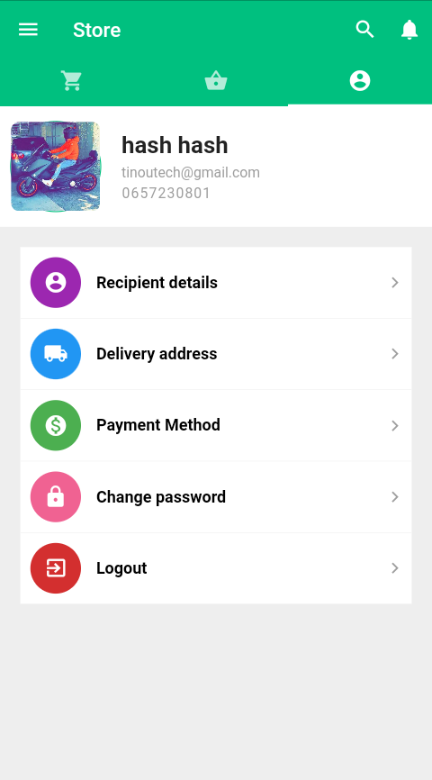
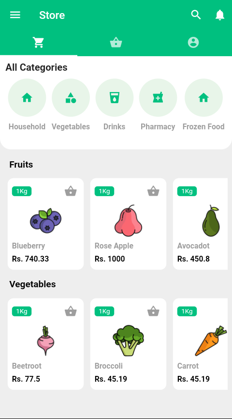

# Grocery App 📱

## Flutter application made for selling fruits and vegetables 🍓🍆.

### Some details about the project 🔍:
- Provider as state management.
- Firebase as backend.
- MVVM as architecture.

### Some screenshots 📸:

    
    
    

